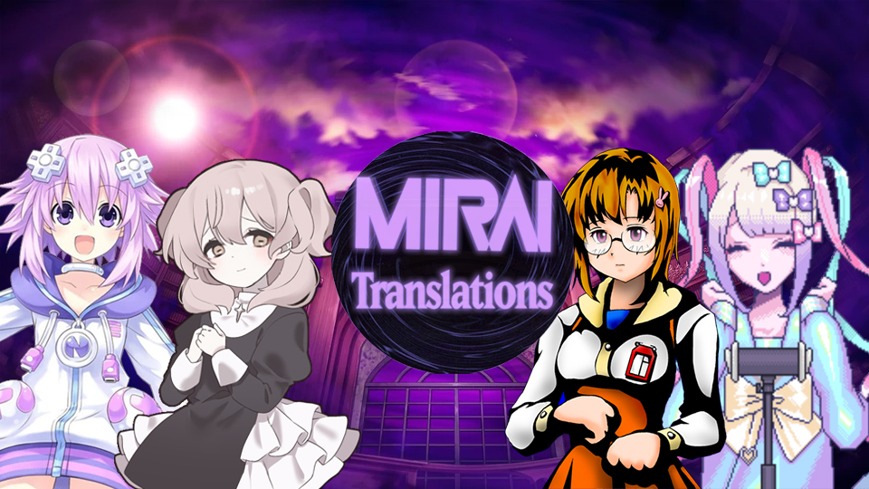
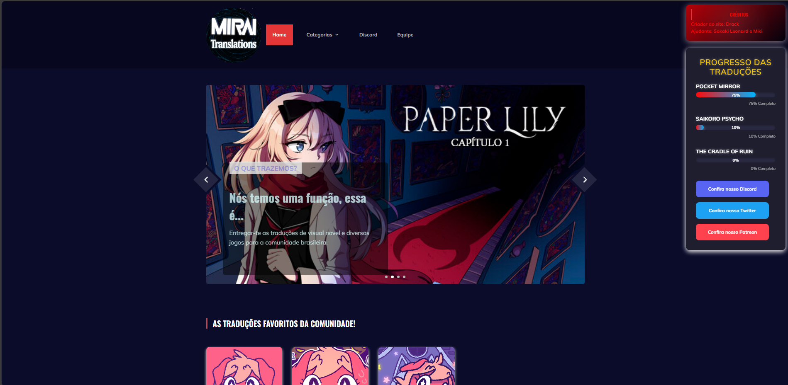

<!-- PROJECT LOGO -->
 

  

  <h3 align="center">Mirai Translations</h3>

  

    O reposítorio oficial da  Mirai Translations
     
    <a href="https://www.miraitranslations.com.br/"><strong>Acessar o nosso site »</strong></a>
     
     
    <a href="https://discord.com/invite/mirai-translations-603325287832354855">Discord</a>
    ·
    <a href="https://github.com/MiraiTranslation/vercel/issues">Report Bug</a>
  

<!-- ABOUT THE PROJECT -->

## Sobre o projeto

O objetivo desse repositório é reformular e refazer passo por passo o antigo site Doki Doki Translate Club/Doki Doki Translate Company e atual Mirai Translations

### Ferramentas usadas

- [Bootstrap](https://getbootstrap.com)
- [JQuery](https://jquery.com)
- [JavaScript]()
- [HTML]()
- [CSS]()
- [SCSS]()

<!-- LICENSE -->

## License

Verifique o arquivo `LICENSE` para analisar as permissões sobre o modelo distribuído.
